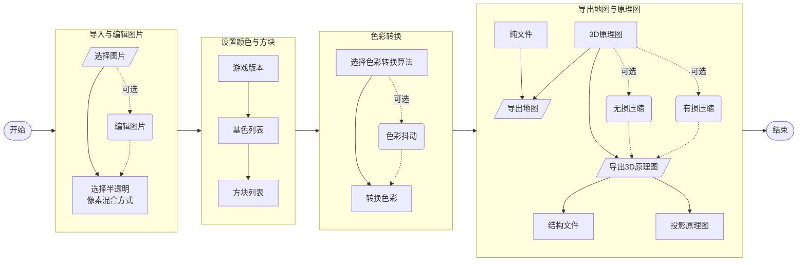

# TODO

- 预处理
  - [ ] 图片编辑
  - [x] 透明像素

- 色彩转换
  - [x] RGB
  - [x] HSV
  - [x] LAB
  - [x] XYZ

- 构建 3D 结构
  - [x] 无损压缩
  - [ ] 有损压缩
  - [ ] AI搭路

- 导出成品
  - [x] 地图文件
  - [ ] 结构方块文件
  - [x] 投影原理图
  - [ ] WE 原理图

## 流程图

